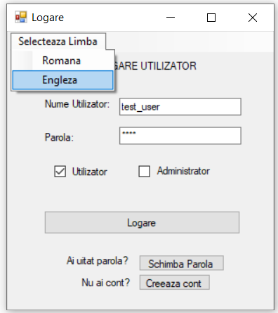
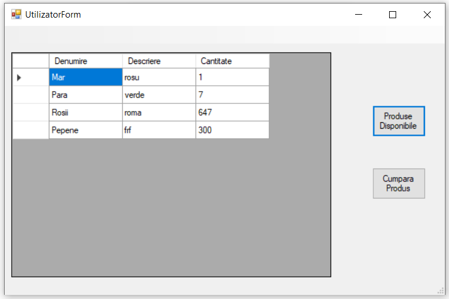
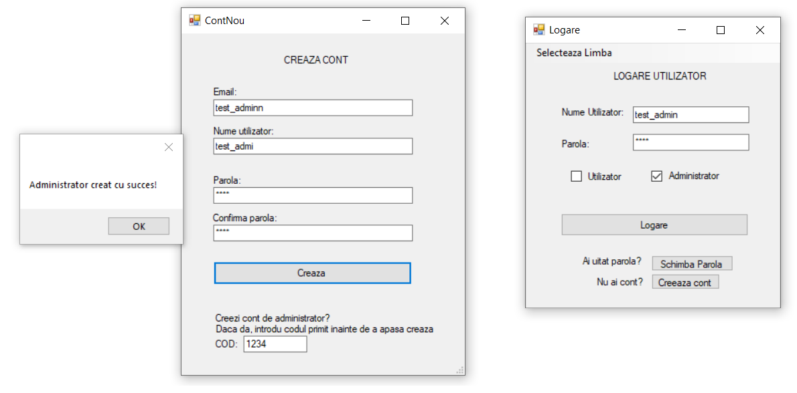
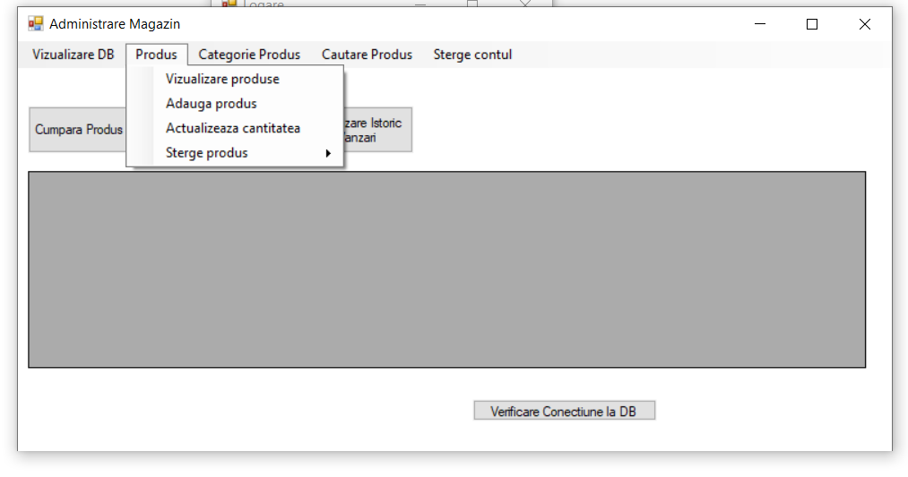
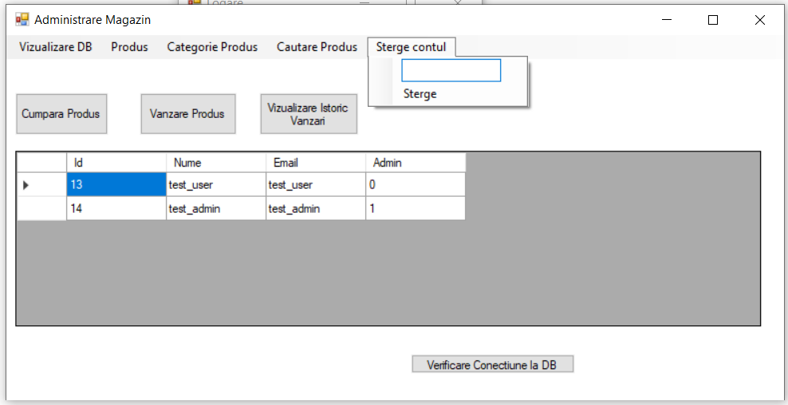
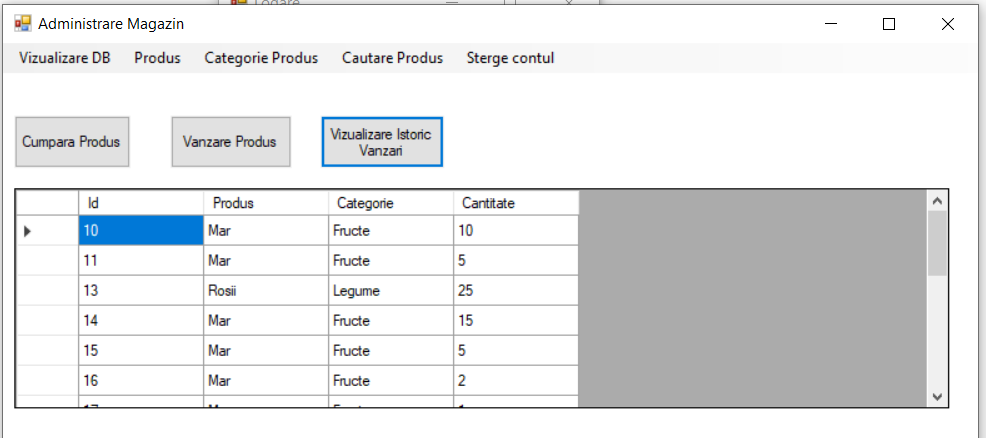

# StoreManagement
C# .NET Store management desktop app with admin/user roles

# Store Management App – .NET C# Desktop Application

This is a desktop-based store management application built in C# using .NET.  
It supports two types of users: Admin and User, with different roles and access. The application also includes multilingual support (English and Romanian).

## Key Features

### User
-  Register and log in
-  View available products
-  Purchase products

###  Admin
-  Admin login or register with code(1234)
-  View full product and user database
-  View sales history
-  Buy and sell products (simulated)
-  Add new products
-  Update product data
-  Delete products
-  Delete users
-  Add or delete products by category

---

##  Login Page – Language Support

The login page allows switching between languages:
-  Romanian
-  English

---

##  Technologies & Concepts Used

- C# with .NET 
- Entity framework -for database access and manipulation using LINQ and DBContext
- Desktop interface (WinForms )
- OOP – Object-Oriented Programming
- CRUD – Create, Read, Update, Delete operations
- Role-based access control (Admin/User)
- Input validation and error handling
- Multilingual interface (localization using resource files)

##  Screenshots

###  Login Page
  
User and Admin login interface with language selection (RO/EN).
---

###  User Interface – View & Buy Products
  
User can view available products and initiate purchase.

---

###  User Interface – Purchase Example
  
Successful product purchase with confirmation message.

---

###  Admin – Register and Login
  
Admin can add, update, or delete products.

---

###  Admin Panel – Manage Products
  
Admin can add, update, or delete products.

---

###  Admin Panel – Manage Users
  
Admin can delete users or manage their data by username.

---

###  Admin Panel – View Sales History
  
Admin view of purchase history.

---
How to Run the App?

Clone this repository: Open a terminal or GitHub Desktop and clone the project repository
git clone https://github.com/your-username/StoreManagement.git